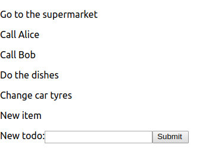
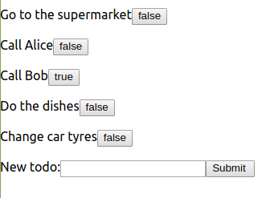
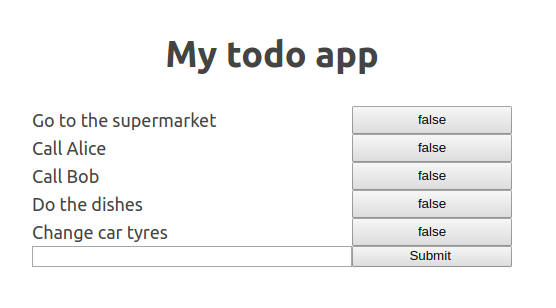
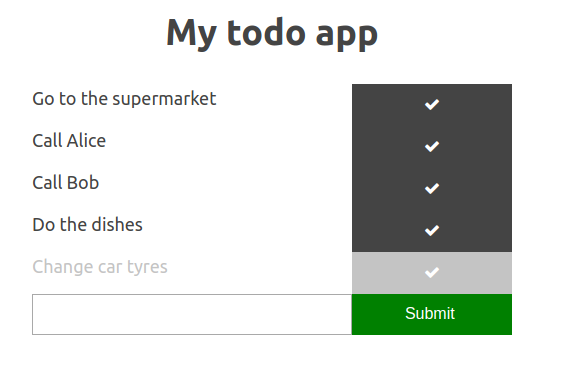

# React todo app

In this exercise we will build a todo app. You should test your app at each stage and not write too much code without testing whether it works. create-react-project automatically reloads your site when you edit and save code in your editor. A good way to check whether your app works 

1. Create a new React application with create-react-app named "todo".
You might need the following things:
```
npm install -g npx          //npx might already be installed
npx create-react-app <name-of-the-app>
```

2. Try running your new app. Running a create-react-app project is done with `npm start`.

3. We want to style our new app by ourselves, so remove all contents of src/App.css. Also remove the contents of the return statement from App.js and return `<h1>todo</h1>` instead.

4. Add the following object outside of the App component:
```jsx
const todos = [
  { id: 1, name: "Go to the supermarket" },
  { id: 2, name: "Call Alice" },
  { id: 3, name: "Ask Alice to call Bob" },
  { id: 4, name: "Do the dishes" },
  { id: 5, name: "Change car tyres" }
];
```

5. Create a new stateless component that takes a todo object as props and returns a `<p>props.name</p>` block.
Here is a simple stateless component: 
```jsx
    const Hello = (props) => {
        return <h1>Hello, {props.name}!</h1>;
    };

    <Hello name="world"/> //<h1>Hello, world!</h1>
    h1>
```

6. Map each object from todos to a todo component and show the new list on the site.

7. Add a constructor for App and add the todos to App's state. [More info.](https://reactjs.org/docs/react-component.html)

8. Modify the earlier code, which shows todos, to also get the todos from the state you initialized in exercise 7.

9. Make a function which generates a new id for a todo. For now using `this.state.todos.length + 1` should suffice. If we would add remove butto for our todos, we would need to add "highestId" value to the component state and increment that when you add a new id.

10. Write a new stateless component which shows a form with input and a submit button (you can omit the label and its text). More info on react forms [here](https://reactjsorg/docs/forms.html) (especially the part about Controlled Components). To use the value in the input field, we need to add its value to our main component's state and then add an onChange function which changes the state as the user types. 
```jsx
//Example implementation of onChange
onChange(event) {
    this.setState({
        newTodoName: event.target.value
    });
}

//Example of an input element with onChange handler
<input
    type="text"
    name="name"
    value={props.newTodoName}
    onChange={props.onChange}
/>
```


11. Make a new stateless component called `<Todos />` which takes a list of todo objects and prints them. Move the code that prints the todos from the main component to this new component. If you already did this in exercise 5, continue to the next exercise.

12. At the moment your Chrome developer tools' console might show an error. This error is caused by the fact that we didn't specify a key for each of the `<Todo />` elements. So why dont you go ahead and add those. More info on [keys](https://reactjs.org/docs/lists-and-keys.html).

13. Add an onClick handler for the InputForm. The handler should add the inputted data to the this.state.todos list. More information about React onClick can be found [here](https://reactjs.org/docs/faq-functions.html).

At this point your app should look something like this <br>


14. We want to be able to mark our tasks as complete. So add a boolean value to our todo objects. Also show to the user whether the task is complete. Simply showing true/false with the task name in the Todo component is enough. You might need to cast the boolean value to a string: `String(ourBooleanValue)`.

15. Install [React Developer Tools](https://chrome.google.com/webstore/detail/react-developer-tools/fmkadmapgofadopljbjfkapdkoienihi). Then open the developer tools and check your App's state. Try changing some of the complete values to see how your app behaves.

16. Make the true/false text a link which flips the value of the todo's status. You will need to add a new onClick handler and pass that to the Todo component. As you need to pass the id to the handler, you will likely need to wrap your custom onClick handler in an arrow function to prevent the onClick being evaluated on page load. 
```jsx
//swapTaskState will be evaluated when the page is loaded
<button onClick={props.swapTaskState(todo.id)}>     
    {String(props.complete)}
</button>
```
```jsx
//swapTaskState will be evaluated when user clicks the button as 
//that is when the arrow function will be called and evaluated.
<button onClick={() => props.swapTaskState(todo.id)}>
    {String(props.complete)}
</button>
```

At this point your app should look something like this: <br>


17. Open the React Developer Tools again. This time change the state from the website and check that you can see the change in the App's internal state.

18. Let's add some styling to our app. Below is some CSS that you can use. Feel free to use your own and edit as you see fit. You will have to add the CSS classes used here to your App jsx/html to see the styling.
```css 

body {
    margin: 40px auto;
    max-width: 480px;
    line-height: 1.6;
    font-size: 18px;
    color: #444;
    padding: 0;
}

h1 {
    text-align: center;
}

.wrapper {
    display: grid;
    grid-template-columns: 2fr 1fr;
}

.complete {
    color: #c4c4c4 
}

.btn {
    background-color: #444;
    border: none; 
    color: white;
    padding: 12px 16px;
    font-size: 16px;
    cursor: pointer;
}

.btn-complete {
    background-color: #c4c4c4;
    color: white; 
}

.btn-success {
    background-color: green;
}
```

19. Change your todo component's main HTML element from `<p>` to `<div>` and give that new div the CSS class `wrapper`. Also give your InputForm a CSS class wrapper. The example CSS assumes that your form is as follows
```jsx
<form className="wrapper">
    <input
        type="text"
        name="name"
        default="Add new todo"
        value={props.newTodoName}
        onChange={props.onChange}
    />
    <input type="submit" value="Submit " onClick={props.handleClick} />
</form>
```

20. Add css classes `.btn` and `btn-success` to your forms Submit button.

21. Add a header for your app. Use `<h1>` for the element if you want the default css to be effective.

At this point your app should look something like this: <br>


22. Differiating between complete and uncomplete tasks visually would be nice. So we want to specify a css class for each of the `<Todo />` components. You can utilize task.complete property to decide when to add `.complete` as a css class.

Here is an example of how to add styling based on props:
```jsx
const header = (props) => {
    //If this header is complete, use css class .done. Otherwise use "" ie no style.
    const completeStyle = props.complete ? "complete" : "";     
    return <h1 className={completeStyle}>{props.text}</h1>;
}
```

23. The complete button is a sore for the eyes. Lets change the button to an icon which indicates whether the task is complete. Add this to the `<head>` in your index.html 'public' folder:
```html
<link rel="stylesheet" href="https://cdnjs.cloudflare.com/ajax/libs/font-awesome/4.7.0/css/font-awesome.min.css">

```

24. Add css classes to make your todos complete buttons show as icons. Example can be found [here](https://www.w3schools.com/howto/howto_css_icon_buttons.asp). You can use the check icon. All icons can be found (here)[https://fontawesome.com/icons?d=gallery]. You can also use classes `.btn` and `.btn-complete` from our custom css. 
```html
<!-- If you add two conflicting css classes to an element (ie both classes 
define some of the same declarations), the latter classes declarations will 
override previous ones conflicting declarations. 
 --> 
<style>
    .header {
        color:red;
        font-size: 10px;
    }

    .bigHeader {
        font-size: 40px;
    }
</style>
<h1 className="header bigHeader"> <!-- red header with font size of 40px -->
``` 

At this point your app should look something like this: <br>


Some ideas for further development:
- If you used (props) => {} style, refactor your app to use [destructuring](https://developer.mozilla.org/en-US/docs/Web/JavaScript/Reference/Operators/Destructuring_assignment) instead. 
- Add typechecking for your components with [PropTypes](https://reactjs.org/docs/typechecking-with-proptypes.html). **Example-todo ends here.**
- Add remove todo button.
- Add sorter to your application. You could first sort them by completion status and then by alphabetical order. More info [here](https://developer.mozilla.org/en-US/docs/Web/JavaScript/Reference/Global_Objects/Array/sort).
- Add date added and date completed values to your todo objects. Remove the alphabetical sorting and sort the uncomplete items by date added and complete items by date completed. If you have date completed, you can remove todo.complete boolean as it is reduntant (refactor your app to use the date completed instead of the boolean todo.complete). You might need [Date](https://developer.mozilla.org/en-US/docs/Web/JavaScript/Reference/Global_Objects/Date).
- Add a validator for the input field. You could add an icon or color to indicate that the input is not proper. When the input is not proper, it should not be added to the list of todos and user should be given a warning instead.
- Add simple backend for the site ([tutorials](https://developer.mozilla.org/en-US/docs/Learn/Server-side/Express_Nodejs))
    - [Fetch](https://developer.mozilla.org/en-US/docs/Web/API/Fetch_API) the initial list from the backend
    - When new todo item is added, post that to the backend
- Write tests for your components using [Enzyme](https://github.com/airbnb/enzyme) and [Jest](https://jestjs.io/). Apps created with create-react-app already have Jest configured, so you can just start adding tests to app.test.js after you have installed Enzyme. Wondering which functionalities you should test? Check [this](https://medium.freecodecamp.org/the-right-way-to-test-react-components-548a4736ab22).

